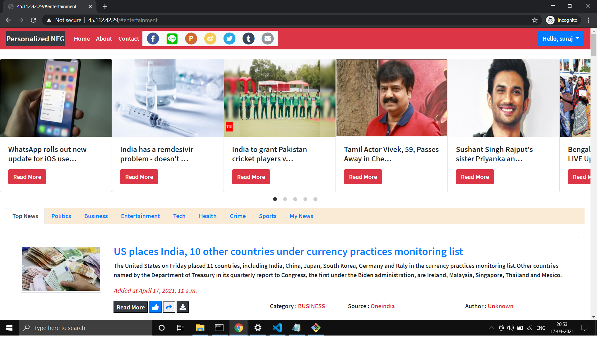

# Personalized_News_Feed_Generator_Using_Django
  
  
  
  <ul>
  <li>
            
It is a Web Application that provides personalized news & event updates to its users without losing out on time or having to go through irrelevant content.
            

        </li>
        <li>
            
Our Website uses Machine Learning Algorithm like Support Vector Machine for classifying the category of the News.
            

        </li>
        <li>
            
News articles will be recommended based on clustering of similar articles, predicting their category, content similarity & keyword extraction.
            

        </li>
  <li>
            
All information regarding the past clicks, likes, engagement  on this website will be taken into consideration  for future content and predictions.
            

        </li>
        
        
  </ul>
  <b>- Get API key from the following websites</b> 
  
  <a href="https://newsapi.org/"> Get API from News.org</a>  
  <a href="https://gnews.io/"> Get API from GNews.io</a>  
  
  <b>- Now go to the news_suggester folder and open scrapper.py file and enter your api key</b> 
  
<b>- Installations</b> 
  `pip install -r Requirements.txt`
  
<b>- Open 3 Terminals in your Project Dir where 'manage.py' file is located and paste the following code</b> 
  `Terminal 1 :- python manage.py runserver`
  
  `Terminal 2 :- celery -A personalized_nfg  beat -l info`
  
  `Terminal 3 :- celery -A personalized_nfg  worker -l info`
  
<a href="https://youtu.be/qd0yf6q7L4E">Demo</a>  
